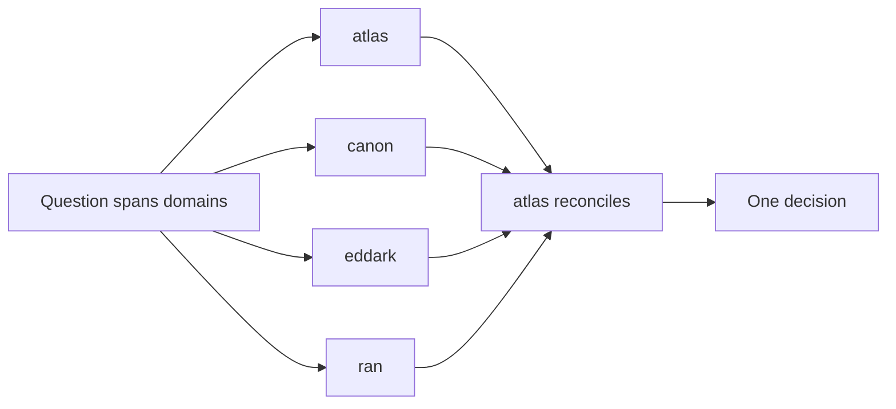
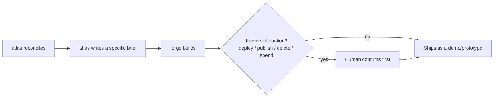

# Squad Routing (task graph for atlas / canon / eddark / ran / forge)

How a question gets to the right seat, who owns the merge when it touches
more than one, and — now that the squad can actually build things — how a
decision turns into real output without forge inventing its own requirements.

## Two stages: decide, then build

The squad is two different kinds of seat, and they don't mix:

- **Decide** (atlas, canon, eddark, ran) — advisory. Each grounds itself in
  its own domain, refuses to guess outside it, and atlas reconciles anything
  cross-domain into one decision.
- **Build** (forge) — execution. Only enters once a decision is actually
  finalized. It does not answer domain questions, does not weigh priorities,
  and does not get consulted in the diamond below — it receives a brief
  *after* the diamond has already produced one.

## Single-domain questions

Ask the seat that owns it directly:

| Domain | Seat |
| --- | --- |
| Priorities, work graph, decisions, cadence, escalation | atlas |
| Canon graph, diagrams, conventions, recipes, provenance, capsules | canon |
| ICP, content systems, community, campaigns, experiments | eddark |
| Onboarding, support, recurring operations, incident learning | ran |
| Turning a finalized brief into real working output (code, prototypes, demos) | forge — only once a brief exists, see below |

## Cross-domain questions — the diamond, not a free-for-all

When a question spans more than one *decide* seat's domain, route it as a
diamond: only the relevant seats get consulted, and exactly one of them owns
reconciling their answers into a single response.

Rules:
- Only consult the seats whose domain the question actually touches — running
  all four on every question is not the point of having four seats.
- **atlas is always the merge owner.** It reconciles whatever the relevant
  seats surface into one answer. No seat's output reaches the user
  pre-merged by anyone else.
- If atlas itself is one of the consulted seats (the question includes a
  priorities/decision angle), it still owns the merge — it doesn't hand that
  off.

## Decision to build — the handoff to forge

Once atlas has a finalized decision that includes something to actually
build, the flow extends by one more step:

Rules:
- atlas hands forge a **specific brief**, not the raw discussion. If the
  brief is vague, forge refuses to guess the missing requirements and sends
  it back rather than inventing them.
- forge builds the smallest version that proves the idea first — not the
  full version — same reasoning atlas and eddark already converge on for any
  build-adjacent decision.
- forge never takes an irreversible action (deploy, publish, delete, spend
  money) on its own. That's a human gate, same principle as atlas's
  escalation rule, just placed at the build stage instead of the decision
  stage.

## Out-of-lane questions

Each seat refuses to answer outside its own domain and names the seat that
actually owns it, rather than guessing outside its lane. Exact refusal
wording lives in each seat's own prompt file.

## Guardrail

The decide layer is two-deep (seats, then atlas as merge owner) and does not
recurse — a seat consulted during a merge does not itself consult other
seats. The build layer adds one more step, not a loop: forge builds from a
brief, it does not go back and re-litigate the decision that produced it.
