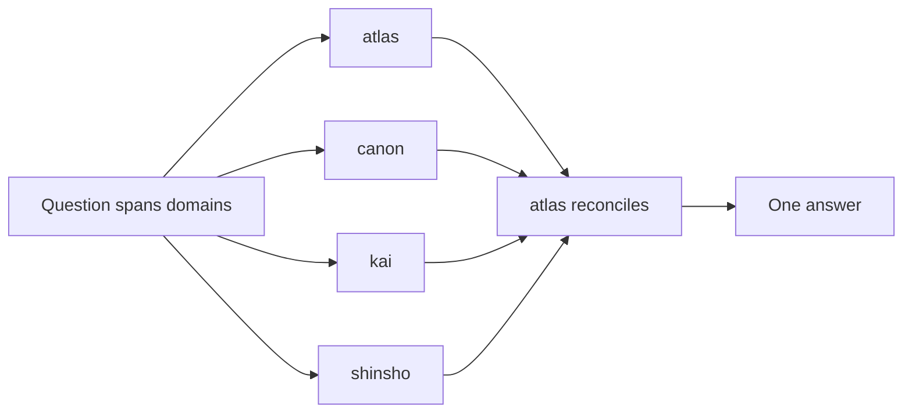

# Squad Routing (task graph for atlas / canon / kai / shinsho)

How a question gets to the right seat, and — this is the part that was missing —
who owns the merge when it touches more than one.

## Single-domain questions

Ask the seat that owns it directly:

| Domain | Seat |
| --- | --- |
| Priorities, work graph, decisions, cadence, escalation | atlas |
| Canon graph, diagrams, conventions, recipes, provenance, capsules | canon |
| ICP, content systems, community, campaigns, experiments | kai |
| Onboarding, support, recurring operations, incident learning | shinsho |

## Cross-domain questions — the diamond, not a free-for-all

When a question spans more than one seat's domain, route it as a diamond: only
the relevant seats get consulted, and exactly one of them owns reconciling
their answers into a single response.

Rules:
- Only consult the seats whose domain the question actually touches — running
  all four on every question is not the point of having four seats.
- **atlas is always the merge owner.** It reconciles whatever the relevant
  seats surface into one answer. No seat's output reaches the user
  pre-merged by anyone else.
- If atlas itself is one of the consulted seats (the question includes a
  priorities/decision angle), it still owns the merge — it doesn't hand that
  off.

## Out-of-lane questions

Each seat refuses to answer outside its own domain and names the seat that
actually owns it, rather than guessing outside its lane. Exact refusal
wording lives in each seat's own prompt file.

## Guardrail

This is a two-layer system (seats, then atlas as merge owner) — it does not
recurse. A seat consulted during a merge does not itself consult other seats.
